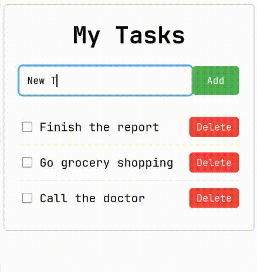

# Hold Shift to Check Multiple Checkboxes

Este es un reto que consiste en agregar tareas a una lista de tareas y poder marcar varias tareas a la vez presionando la tecla `shift`.

## Tecnologías

*   HTML
*   CSS (con notación BEM)
*   JavaScript

## Screenshots




## Cómo Utilizarlo

Dado que es un proyecto estático, no requiere instalación. Simplemente clona o descarga este repositorio y abre el archivo `src/index.html` en tu navegador web preferido.

```bash
git clone https://github.com/joseenrique61/RetoJS.git
cd RetoJS
# Abre src/index.html en el navegador
```

## Link al deploy del reto

[Click aquí para ver el deploy del reto](https://joseenrique61.github.io/RetoJS/)

## Autor

[<br><sub>José Enrique Cerezo</sub>](https://github.com/joseenrique61)

## Licencia

Este proyecto es de código abierto y está disponible para uso y modificación bajo la licencia MIT. Consulta el archivo [LICENSE](LICENSE) para más información.
